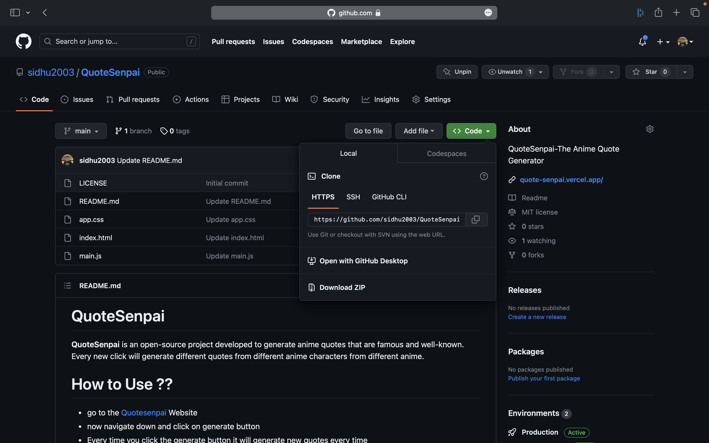

# static website deployment automate script

## About

This bash script is designed to streamline the process of deploying a static website. It takes care of various tasks, reducing manual effort and increasing efficiency. The script combines multiple steps into a cohesive workflow, providing a seamless experience for deploying static websites.

## How to run the script 

- Launch any EC2 Instance on cloud platforms like AWS, Azure,and GCP
- Now access the SSH of the Instance created
- now upload the `deploy.sh` to the Instance
- Edit the script file with the markers < > as per your requirement
- run `./deploy.sh` command and **relax !!!**

## Guide for usage of the script file 

- type the following command below before executing the script file 

``` 
chmod -x deploy.sh 
``` 
- now get the link of zip file of your github repository



- ensure that link is ending with **main.zip**
- give the repo name correctly before `-main`
- For more detail check the `example_Script.sh`

## Notes for users 

- this is completely secure script 
- This is using apache server for the deployment (You can use alternatives if you can)
- Change the details carefully to make the script work

## Contributers note 

- I am thrilled to announce that this website is open to contribution! Our project is open-source and completely free to contribute to. We believe that everyone has something valuable to bring to the table, and we would love to have your input.

- Whether you're a seasoned developer or just starting out, we welcome contributions of all levels. You can help us improve the project by reporting bugs, submitting feature requests, or even submitting code changes. We also welcome contributions in the form of documentation, user testing, or community management.

- Our aim is to build a collaborative community where everyone is welcome and valued. We believe that open-source is the way of the future, and we're excited to see what contributions you will bring to the table.

## LICENSE 

The source code is licensed [apache2](https://github.com/sidhu2003/static-website-deployment-automate-script/blob/main/LICENSE)

***Copyright (c) 2023 [Venkata Siddardha Rali](https://github.com/sidhu2003)***
